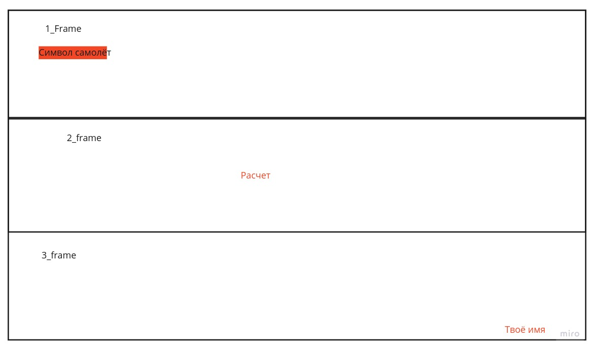

## Задача ##
Создать окно с помощью библиотеке tk or ttk.
В окне должно быть 3 Frame
***1_Frame***
Нужно реализовать смайлик самолёта (сам хз как сделать)
***2_Frame***
Нужно реализовать кнопку 'Расчёт', при нажатии пишется твоё имя в консоли 
***3_Frame***
Нужно в нижнем правом углу напечатать твою фамилию и инециалы

***Примечания***
Окно должно раздвигаться и виджаты(кнопка, текст, смайлик) тоже должны перемещаться
```shell
frame.place(relx=0, rely=0, relwidth=0.45, relheight=0.18)# пример реализации
#rely - в працентах до куда раздвигаться по y
#rely - в працентах до куда раздвигаться по x
```


На счёт остального лучше сам подумай, но если чего, то пиши